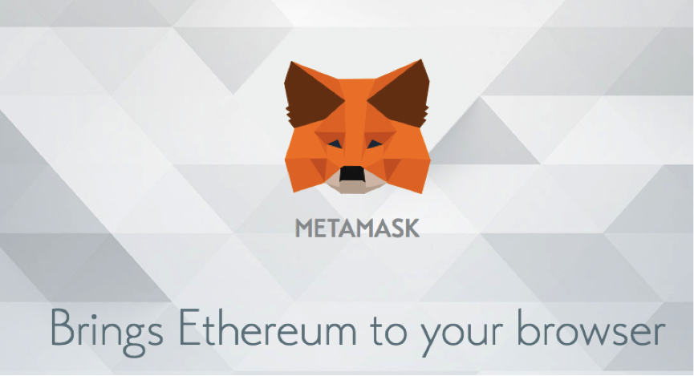
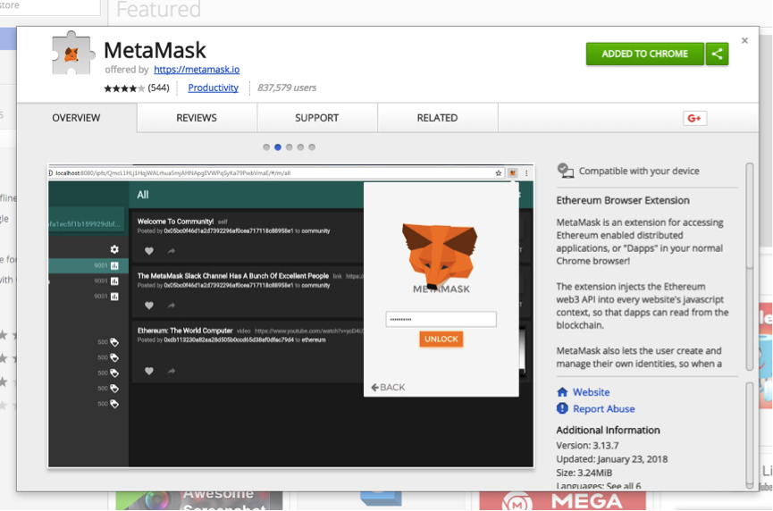
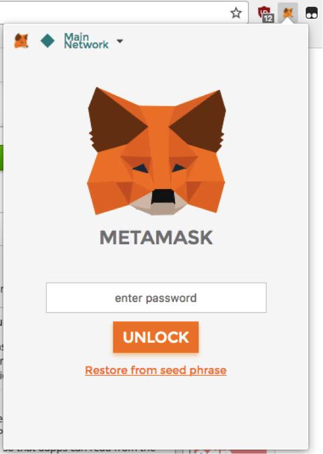
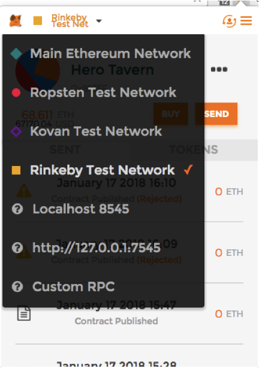
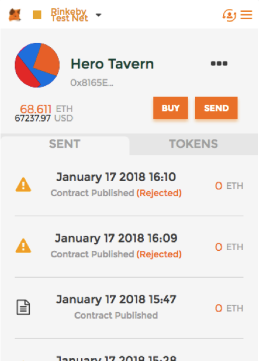
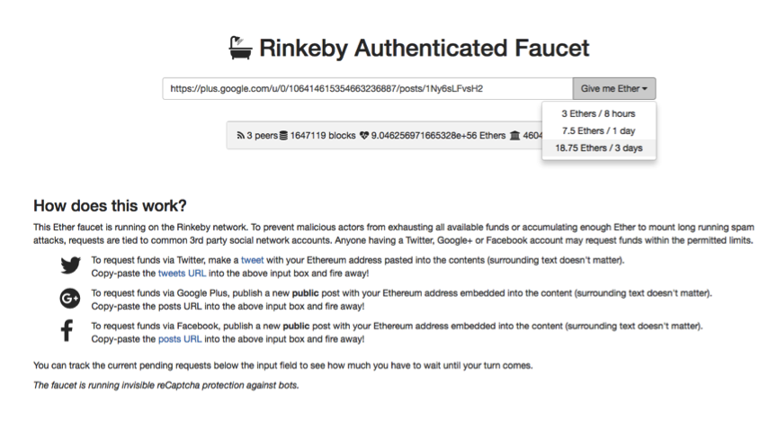

# Player Manual
### Beta Version*
 

## Step 1 :rocket: Download Chrome or FireFox Browser
 Google Chrome  FireFox

## Step2 :rocket: Install MetaMask
-	Enter Website https://metamask.io/

-	In Chrome, add MetaMask to Chrome Extension
-	You will find MetaMask icon at top-right corner

 

 
 
## Step 3 :rocket:    Create a Wallet via MetaMask
-	Create a password in order to create your wallet
-	**[Important]** Remember 12 seed phrases and keep it save
-	Login and Switch to Rinkeby Test Net  
   
 

## Step 4 :rocket:   Apply for Funds to your Wallet
-	Enter Website https://faucet.rinkeby.io/
 
-	Follow the instructions on the bottom of the Page
-	To Publish a Post on Twitter, Google+ or Facebook
-	Copy the URL of the Post and Paste it in the box
-	Apply for the amount of ETH you need
-	Wait for few seconds
 

## Step 5 :rocket:   Purchase Your First Hero
-	Enter Market -> HeroMarket and Pick a Hero
-	Click Buy Button and Purchase 

## Step 6 :rocket:    Purchase Your First Item
-	Enter Market -> ItemMarket and Pick A Item
-	Click Buy Button and Purchase 

## Step 7 :rocket:   Equip Your Item to a Hero
-	Enter MyTavern -> MyHero
-	Pick a Hero and Click to enter its main page
-	Click the proper equipment slot of the Hero
-	Select the right item and equip
-	After item is equipped, click the same slot again to take off the item

## Step 8 :rocket:   Get Eligibility to A Monster Hunt
-	Enter MonsterHunt -> MonsterWanted
-	Pick a Wanted and pay the Deposit

## Step 9 :rocket:   Conquer Monster and Claim Rewards
-	Enter MonsterHunt -> My Hunts
-	Pick a Monster that you want to conquer and Click
-	Enter Monster Main Page, select your heroes and add them to the team
-	Click Start Battle Button in the Bottom
-	Wait Battle is over and Click Claim Rewards Button

## Step 10 :rocket:  Hero Upgrade and Hero Talent Wash
-	Enter Factory -> HeroUpgrade
-	Pick a Hero, if the Hero has enough Exp to upgrade then Click Upgrade
-	Wait until upgrade is finish and then click Finish button to finish upgrading
-	Enter Factory -> HeroTalentWash
-	Pick a Hero, pay wash fee to wash hero’s talent
-	The current Combat Power of the Hero will change

## Step 11 :rocket:   Sell Heroes or give Heroes to a Friend
-	Enter MyTavern -> MyHero
-	Pick a Hero and enter its main page
-	Click Sell Button in the bottom to sell
-	Fill out Starting Price, Buy Now Price and Durance to start the Sale
-	Click Gift Button in the bottom to give away
-	Fill out the receiver’s address and Click Confirm Button to send the gift

## Step 12 :rocket:    Sell Items or give Items to a Friend
-	Enter MyTavern -> MyItem
-	Pick a Item and enter its main page
-	Click Sell Button in the bottom to sell
-	Fill out Price and Click Confirm Button to start the Sale
-	Click Gift Button in the bottom to give away
-	Fill out the receiver’s address and Click Confirm Button to send the gift

## Step 13 :rocket:   Bid Hero Auction
-	Enter Market -> HeroMarket
-	Click Bid and Enter the amount you want to offer
-	Wait Auction is over and Click Check Button to Complete the Auction

